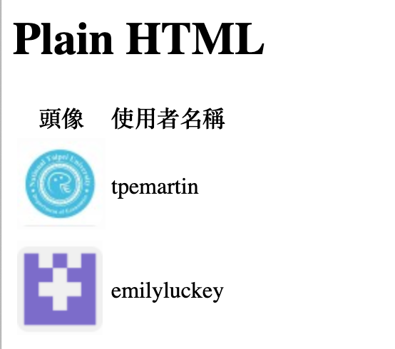

# HTML/CSS 2 {#htmlcss2}

## 教材

  * 網頁程式設計基礎: https://www.openedu.tw/course.jsp?id=765

  * 下載[RmdTemplateHtml.Rmd](https://drive.google.com/open?id=1r4AHjPcirfeaNvjRoIopIhUmiy4nivvf)與[plainHTML.Rmd](https://drive.google.com/open?id=1v_MMgQguYvo8Gk-2nbgdCdsQuQvTyA-Y)（必需有加入Google classroom此連結才會有效）

<iframe src="https://player.vimeo.com/video/397441578" width="640" height="480" frameborder="0" allow="autoplay; fullscreen" allowfullscreen></iframe>

## 學習主題

  * 建立一個Project. 
  
  * Rmd檔引入外部檔案。
  
  * 路徑。
  
## 主題內容

### 建立Project

**File > New Project > New Directory/Existing Directory**

### Rmd frontmatter

  * 由Rmd產生單純html檔的設定

```
output: 
  html_document:
    theme: null
    highlight: null
    mathjax: null
    self_contained: false
```

  * head content外部引入

```
output:
  html_document:
    includes:
      in_header: "外部檔案路徑"
```

<div class="alert alert-warning">
若frontmatter已有output > html_document設定，只需貼上includes的部份，如：
```
output: 
  html_document:
    theme: null
    highlight: null
    mathjax: null
    self_contained: false
    includes:
      in_header: "外部檔案路徑"
```
</div>

  * after-body content外部引入

```
output:
  html_document:
    includes:
      after_body: "外部檔案路徑"
```


<div class="alert alert-warning">
若frontmatter已有output > html_document > includes設定，只需貼上after_body的部份，如：
```
output: 
  html_document:
    theme: null
    highlight: null
    mathjax: null
    self_contained: false
    includes:
      in_header: "外部檔案路徑"
      after_body: "外部檔案路徑"
```
</div>

### Rmd產生body內容

  * 其他body部份放入html語法。
  
Rmd裡，frontmatter以外的部份knit完都會是body的內容，如果要在body裡放html 語法有兩種作法： 

1. 直接放html語法（但不可內縮超過一層）

內縮一層可以
```
<table>
  <tr>
  <th>Company</th>
  <th>Contact</th>
  <th>Country</th>
  </tr>
  <tr>
  <td>Alfreds Futterkiste</td>
  <td>Maria Anders</td>
  <td>Germany</td>
  </tr>
</table>
```

內縮兩層不行
```
<table>
  <tr>
    <th>Company</th>
    <th>Contact</th>
    <th>Country</th>
  </tr>
  <tr>
    <td>Alfreds Futterkiste</td>
    <td>Maria Anders</td>
    <td>Germany</td>
  </tr>
</table>
```

2. 先插入一個r chunk (點Knitr鍵右邊的Insert > R 可產生r chunk), 再輸入

```
htmltools::includeHTML("外部html檔案")
```
此法不受html語法內縮幾層影響。


## 課後練習

### A

下載資料匣[02_A_exercise](https://drive.google.com/open?id=1zNLDh8XO2zwwD_Vt3_eziATn9ZwpF0hR)完成page1.Rmd及subpage/page2.Rmd使兩者knit完的html畫面如下，使用table及img相關html tags.

```{r, echo=FALSE}

```


### B

網頁設計往往會使用某些現成架構（framework）來簡化設計過程，如Bootstrap。要使用現成framework通常需要在head及after body加上某些html語句。請使用Rmd，依[Bootstrap Quick Start](https://getbootstrap.com/docs/4.4/getting-started/introduction/)
下載[02_B_exercise.Rmd](https://drive.google.com/open?id=1sCcG77lA7p-YiU5ZMLD-PQwSR7Xkfkz7)（必需有加入Google classroom此連結才會有效），透過`includes`設定來產生Bootstrap的架構。