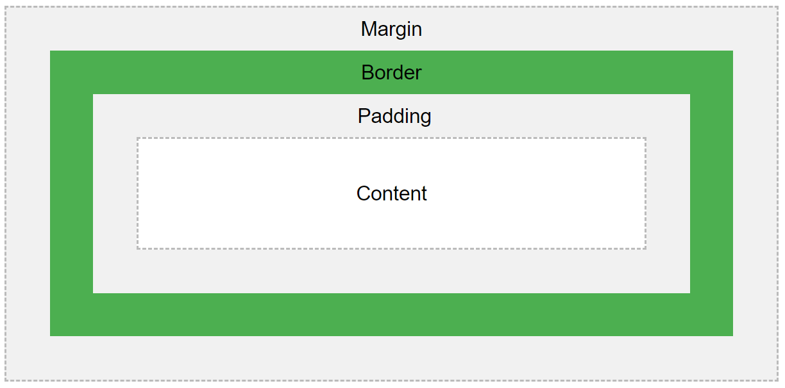

# HTML/CSS 3 {#htmlcss3}

講解成員：國立臺北大學經濟學系 邱詩涵 

## 教材

  * 網頁程式設計基礎: https://www.openedu.tw/course.jsp?id=765

<iframe src="https://player.vimeo.com/video/399378421" width="640" height="344" frameborder="0" allow="autoplay; fullscreen" allowfullscreen></iframe>

## 學習主題

  * CSS 介紹、如何在網頁查看 CSS 內容
  
  * 選擇器、方盒模型
  
  * 常用 CSS 效果
  
## 主題內容

### CSS 介紹

  * 改變網頁風格
  
  * 協助網頁排版

### 如何在網頁查看 CSS 內容

  * 在想要查看 CSS 的網頁中，點擊右鍵，選擇【檢查】

### 選擇器

  * CSS 語法結構 
```
.div{
font-size: 10px; 
}
```
  * 撰寫位置
  1. 內部( 放在`<head>`裡 )
```
<head>
  <style>
  .div{
  font-size: 10px;
  }
  </style>
</head>
```
  2. 外部( 建立`.css`外部檔案並匯入`<head>`中)
```
<head>
<link rel="stylesheet" href="____.css">
</head>
```
  3. 嵌入( 直接加在 `<html tag>` 裡)
```
<p style="font-size: 10px;"></p>
```
### 方盒模型
```{r, echo=FALSE}

```

  * margin : 元素之間的距離

  * border : 邊框
  
  * padding : 區域內元素之間的距離
  
### 常用 CSS 效果


## 課後練習

### A

下載資料匣[0304_A_exercise](https://drive.google.com/drive/folders/1UEoMgYYydQcn5-xK2pbjps-aCtJJX_Gu?usp=sharing)。先在 R 裡建立一個 HTML 文件，並模仿上述資料夾的 UIUX.html 裡所有 Tag 與 CSS 設計(以內部方式加上 CSS ，元素距離顏色可更改)。

Hints: 查詢 W3schools HTML Tag `<a>` 與 CSS `text、box-shadow`

### B

使用第二章作業 B `02_B_exercise.Rmd` 裡的格式，透過`include`設定產生 練習A 的 UIUX.html(外部 CSS 引入)。


